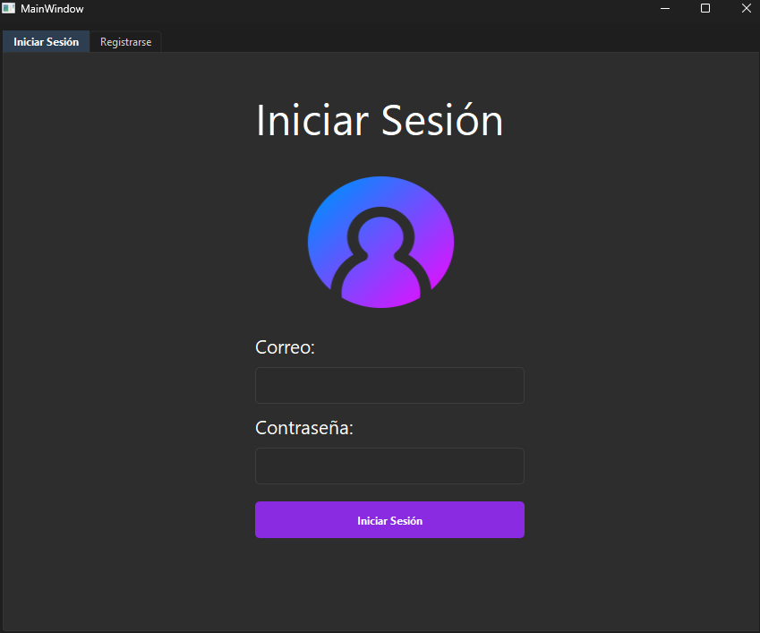
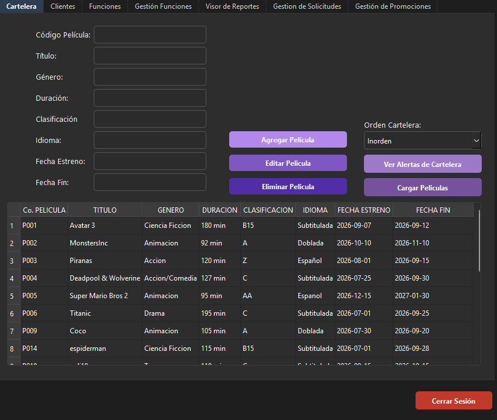
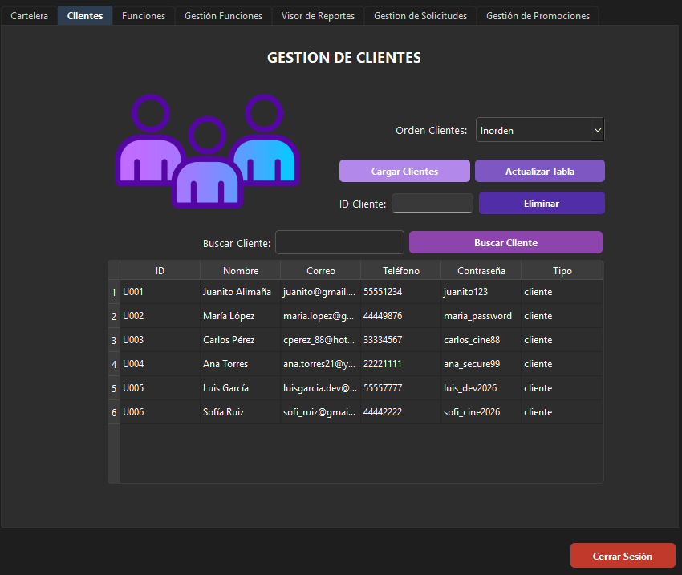
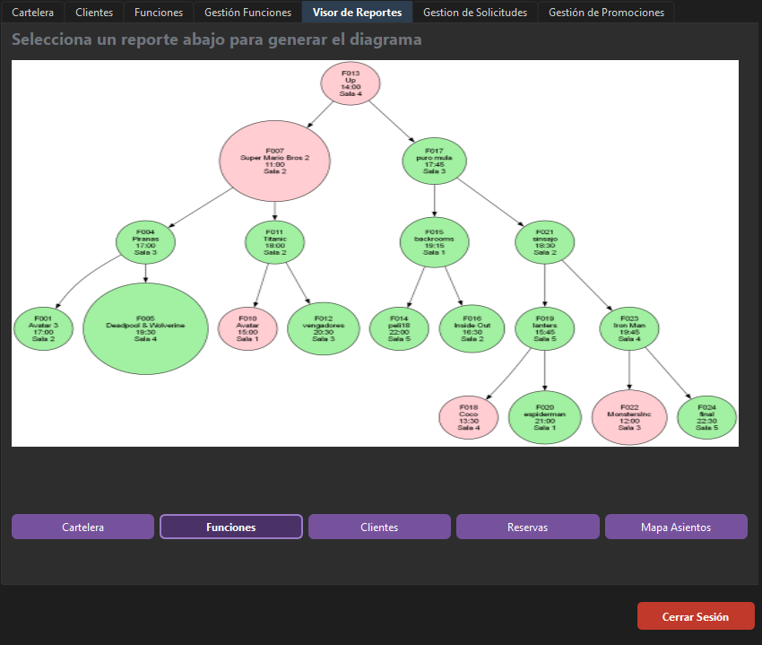
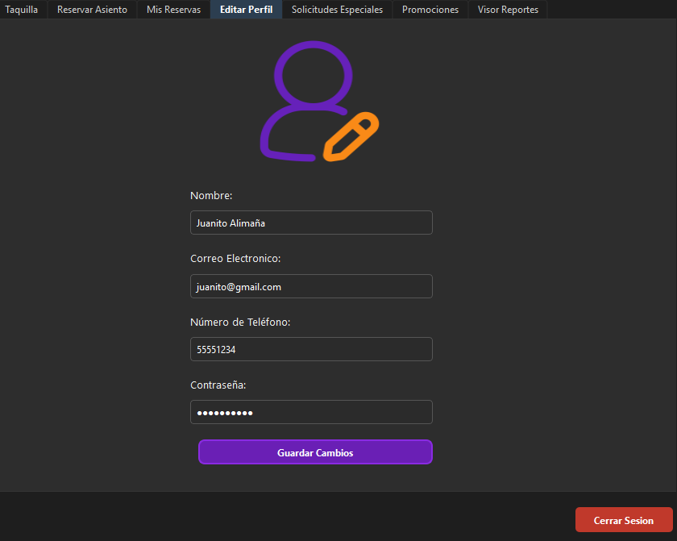
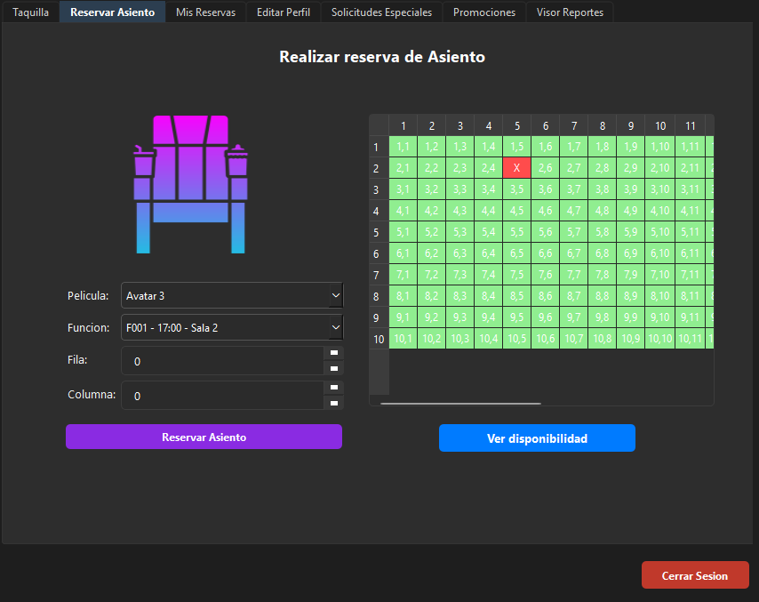
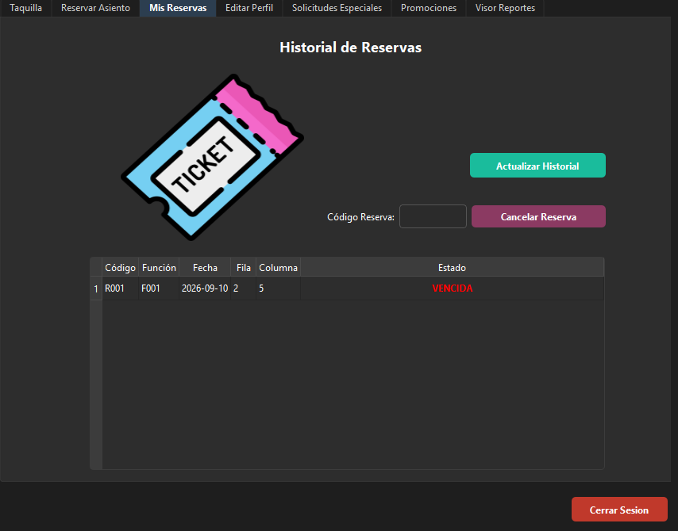

# Manual de Usuario - Sistema de Gestión de Cine (Fase 2)

Bienvenido al Manual de Usuario del Sistema de Gestión de Cine. Este documento proporciona una guía paso a paso para utilizar las funcionalidades de la plataforma, divididas entre el Módulo de Administrador y el Módulo de Cliente.

## 1. Requisitos del Sistema

* Sistema Operativo: Windows 10/11, macOS, o Linux.
* Graphviz instalado y configurado en las variables de entorno (PATH) del sistema operativo.
* Archivos JSON con estructura válida para las cargas masivas.

## 2. Acceso al Sistema (Login)

Al iniciar la aplicación, se presenta la pantalla de inicio de sesión.

* **Para Administradores:** Ingrese sus credenciales de administrador (ej. `admin` / `admin`).
* **Para Clientes Existentes:** Ingrese su DPI y contraseña.
* **Para Clientes Nuevos:** Haga clic en el botón de **Registrarse** para crear una nueva cuenta llenando el formulario con sus datos personales.

---

## 3. Módulo de Administrador

El panel de administrador permite el control total sobre la cartelera, las funciones, los usuarios y la visualización de la estructura interna del sistema.

### 3.1 Gestión de Películas y Funciones

Desde esta pestaña, el administrador puede realizar operaciones individuales (CRUD) o masivas.

* **Carga Masiva:** Haga clic en "Cargar Películas" o "Cargar Funciones" y seleccione el archivo `.json` correspondiente en el explorador de archivos.
* **Gestión Individual:** Llene los campos de texto (Código, Título, Duración, etc.) y presione **Agregar**, **Editar**, o **Eliminar**.
* **Alertas:** Al ingresar a esta pestaña, el sistema notificará automáticamente si existen películas a menos de 7 días de salir de cartelera.

### 3.2 Gestión de Clientes

Permite visualizar a todos los usuarios registrados en el sistema.

* **Carga Masiva de Clientes/Reservas:** Utilice el botón correspondiente para importar un archivo JSON. El sistema vinculará automáticamente a los clientes con sus reservas existentes.
* **Listar Clientes (Recorridos):** Utilice el menú desplegable (ComboBox) para ordenar la tabla según los recorridos matemáticos del Árbol B:
  * *Inorden:* Ordenado por DPI.
  * *Preorden:* Raíces primero.
  * *Postorden:* Hojas primero.

### 3.3 Visualizador de Reportes (Graphviz)

Esta sección permite auditar visualmente las estructuras de datos en memoria.

* **Árbol BST (Películas):** Muestra las películas. Los nodos en verde están activos; en amarillo, próximos a expirar.
* **Árbol AVL (Funciones):** Muestra funciones programadas. Nodos verdes para funciones futuras, rojos para funciones pasadas.
* **Árbol B (Clientes):** Dibuja la estructura jerárquica de usuarios registrados.
* **Tabla Hash (Reservas):** Mapea los buckets y colisiones de las reservas globales. (Si la imagen es muy grande, se abrirá en el visor nativo de su sistema).
* **Matriz Dispersa (Asientos):** Muestra el mapa ortogonal de la sala para una función específica. **Nota:** Primero debe escribir/seleccionar el código de la función antes de generar este reporte.

---

## 4. Módulo de Cliente

Interfaz dedicada a los usuarios para la compra y gestión de boletos de cine.

### 4.1 Edición de Perfil

Al iniciar sesión, el cliente puede actualizar su información personal.

* Al abrir esta pestaña, sus datos actuales aparecerán precargados.
* Modifique su Nombre, Correo, Teléfono o Contraseña y presione **Guardar Cambios**. (El DPI no es editable por seguridad).

### 4.2 Reserva de Boletos

Permite la compra de entradas interactuando directamente con el mapa de la sala.

1. Seleccione la película y función deseada.
2. El sistema desplegará las dimensiones de la sala.
3. Ingrese la fila y columna del asiento que desea ocupar y presione **Reservar**. El sistema validará si el asiento está libre.

### 4.3 Historial y Cancelación de Reservas

Permite al usuario gestionar los boletos que ha adquirido.

* **Actualizar Historial:** Haga clic en este botón para cargar todas sus reservas. La tabla mostrará los detalles completos y resaltará en color verde las reservas "VÁLIDAS" y en rojo las "VENCIDAS".
* **Cancelar Reserva:** Seleccione una reserva válida de la lista y haga clic en eliminar para liberar el asiento en la matriz de la función.
